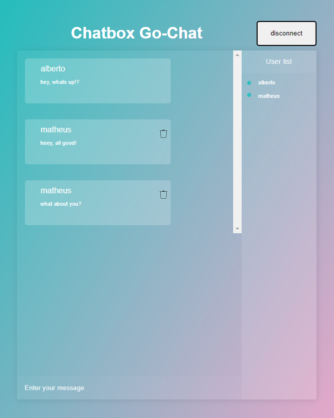

# go-chat

<p align="center">
    go-chat is a golang udp server/udp client/web application 
  

  
</p>

---

## Key Features

* Handle many chatters/users at the same time
* Store up to 20 messages
* Chatter can delete his own messages as long as he is connected
* When everyone leaves the room, all data is flushed

---

## How It Works

There are 3 essencial parts of this project: 
* Web Client (front-end)
* Web Server/UDP Client (back-end)
* UDP Server (back-end)

## Flow

>When a user perform an action in the Web Client, the Web Client send a message to Web Server;
<br>
>Web Server reads the message, translate and send it to Web Server;
<br>
>UDP Server reads the message, perform the action and sends the message to all UDP Client (users);
<br>
>UDP Client reads the message, translate and send it back to Web Client;
<br>
>Web Client reads the message and perform the action;

---
## How To Use

To clone and run this application, you'll need [Git](https://git-scm.com) and [Docker](https://docs.docker.com/engine/install/) installed on your computer. From your command line:

```bash
# Clone this repository
$ git clone https://github.com/albertojnk/go-chat.git

# Go into the repository
$ cd go-chat

# Install docker -- please follow the instructions in the docker website provided above
...

# After docker is installed
$ docker-compose up
```

After docker compose is up and running, go to your browser at [localhost:9000](http://localhost:9000/), insert your username and connect.

> **Note**
> If you want to test features, on your second+ login use a different username and a different browser, otherwise the program does not work properly.

---

## Credits

This software uses the following open source packages:

- [Golang:1.18.3](https://go.dev/doc/install)
- [Redis](https://redis.io/download/)
- [Docker](https://docs.docker.com/engine/install/)
- [HTML](https://developer.mozilla.org/en-US/docs/Web/HTML)
- [JavaScript](https://developer.mozilla.org/en-US/docs/Web/JavaScript)
- [CSS](https://developer.mozilla.org/en-US/docs/Web/CSS)
- [JQuery](https://jquery.com/download/)

---

## Contact Info

> [Linked-In](https://www.linkedin.com/in/alberto-janicke-b81b8b145/) &nbsp;&middot;&nbsp;
> [GitHub](https://github.com/albertojnk) &nbsp;&middot;&nbsp;
> [Email](albertojanicke@live.com)
